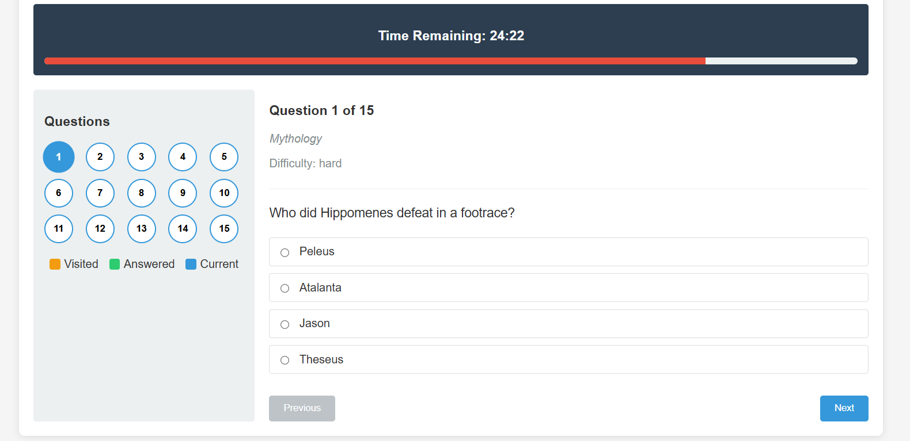

# Quiz Application

A responsive quiz application built with React that fetches questions from the OpenTDB API.

 <!-- Add your screenshot here -->

## Features

- User authentication with email validation
- 15 randomized questions with a 30-minute timer
- Question navigation with progress tracking
- Detailed results report with answer comparison
- Responsive design for all screen sizes
- Smooth transitions between questions

## Installation

1. Clone the repository:
```bash
git clone https://github.com/yourusername/quiz-app.git
cd quiz-app


Install dependencies:

bash
npm install
Start the development server:

bash
npm start
Open your browser to:

text
http://localhost:3000
Project Structure
text
quiz-app/
├── public/            # Static files
├── src/
│   ├── components/    # React components
│   ├── styles/        # CSS files
│   ├── App.js         # Main application component
│   └── index.js       # Application entry point
├── package.json       # Project dependencies
└── README.md          # Project documentation
Components
App - Main application container

EmailForm - Handles user email input

Quiz - Manages quiz flow and state

Question - Displays individual questions

NavigationPanel - Shows question progress

Timer - Countdown timer component

Report - Displays quiz results

API Usage
The application fetches questions from:

text
https://opentdb.com/api.php?amount=15
Available Scripts
npm start - Runs the app in development mode

npm run build - Builds the app for production

npm test - Launches the test runner

npm run eject - Ejects from Create React App

Dependencies
React 18+

React DOM

React Scripts

Challenges & Solutions
API Integration - Fixed incorrect API endpoint and added error handling

Answer Shuffling - Implemented Fisher-Yates shuffle algorithm

Timer Management - Used React hooks for persistent countdown

Responsive Design - Added media queries and flexible layouts

Future Improvements
User authentication

Score tracking

Question categories selection

Answer explanations

Pause/resume feature